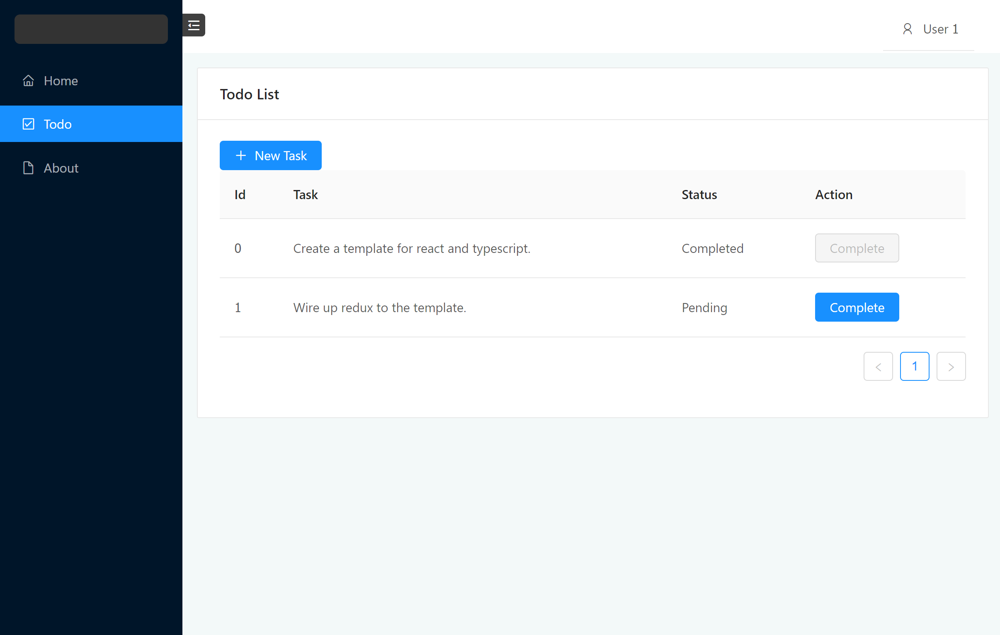

# typescript-react-hot-reload


This is a very simple boilerplate for creating React web applications with TypeScript. It is configured with webpack dev server and hot module replacement to allow changes to be loaded while the application is running. The following is a preview of it:



This boilerplate is based on the following packages:

* [webpack 4](https://webpack.js.org/)
* [webpack-dev-server](https://github.com/webpack/webpack-dev-server)
* [typescript](http://www.typescriptlang.org/)
* [react 16](https://reactjs.org/)
* [redux 4](https://redux.js.org/introduction)
* [antd 4](https://github.com/ant-design/ant-design/issues/21656)

For recent changes, please check [changelog.md](./CHANGELOG.md).

## Install

How to use this template:

```shell
git clone https://github.com/chunliu/typescript-react-hot-reload.git
npm install
npm start
```

## Other reference:

* [TypeScript document](https://www.typescriptlang.org/docs/handbook/react-&-webpack.html)
* [Hot Module Replacement in webpack](https://webpack.js.org/concepts/hot-module-replacement/)

All feedback and pull requests are welcome.
